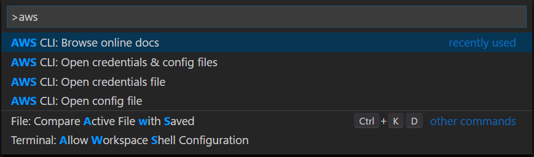

# AWS CLI Configure for Visual Studio Code

The AWS CLI Configure extension allows you to quickly access AWS CLI information and docs from Visual Studio Code.

## Features

The extension adds commands for the following:
* Open 'credentials' file
* Open 'config' file
* Open 'credentials' & 'config' files
* Browse the online docs
* Show [named] profile mapped to [default] in 'credentials'
* Set 'credentials' [default] profile to...
* Copy profile name from 'credentials'...

### Commands

### Copy profile name

Now the name is on the clipboard. Paste away!

### Show named profile mapped to default

- Saving the 'credentials' file from VSCode or setting the default profile updates the status bar. 
- Click the item in the status bar to set the [default] profile to a [named] profile.

### Set default profile

## Known Issues

No known issues

## Release Notes

See Changelog

## License
This software is released under [MIT License](http://www.opensource.org/licenses/mit-license.php)
© [Mark Tucker (@rmtuckerphx)](https://github.com/rmtuckerphx) & Contributors

## Review
Feedback and contributions welcome. Please leave a [review](https://marketplace.visualstudio.com/items?itemName=mark-tucker.aws-cli-configure#review-details).